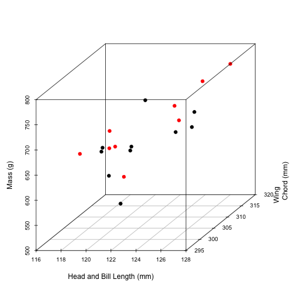
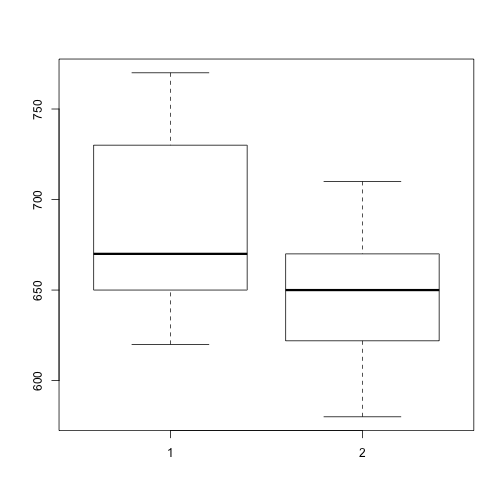
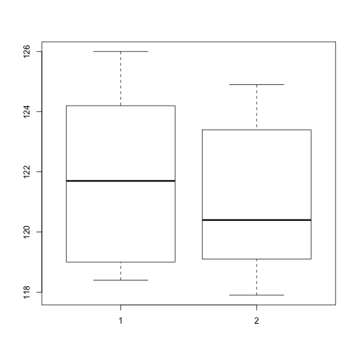
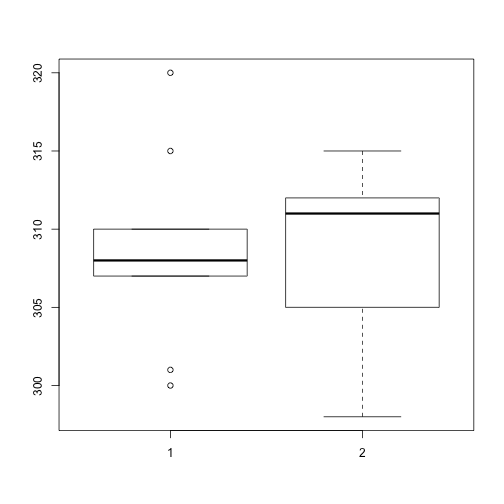
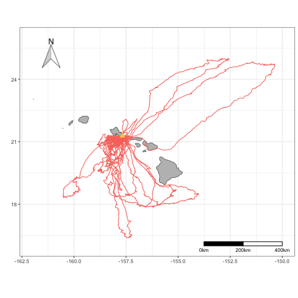
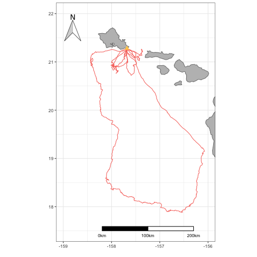
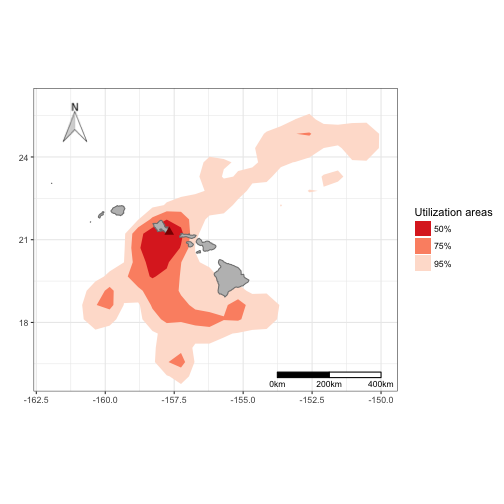
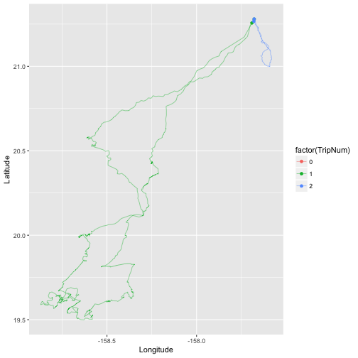
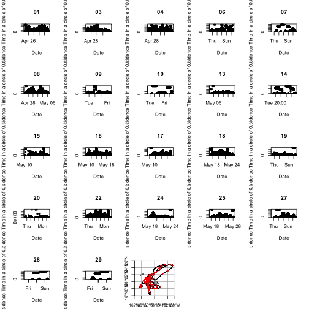
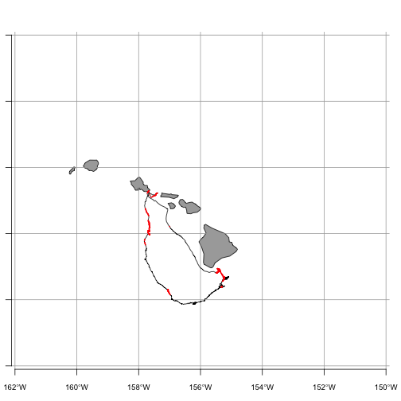

## Data Collection
The Red-tailed Tropicbird (Phaethon rubricauda) is common throughout the tropical Indian and Pacific Oceans, yet there is little information about its behavior at sea, particularly in the central Pacific where there are sizeable breeding populations in the Hawaiian Islands. We GPS-tracked adult chick-rearing tropicbirds (n=22) from a colony on Oahu during April–May 2017 in order to collect information on their distribution and habitat use at sea. Birds were captured by hand on their nest before a foraging trip, weighed in a cloth sack using a spring scale, banded, and fitted with a tracking device. Lightweight archival GPS loggers weighing 18-20g (i-gotU GT-120) were taped to 3-4 central tail feathers using adhesive tape (Tesa, Germany) and configured to a sampling rate of 3 minutes. The weight of the logger represented 2-3% of the bird’s body mass, therefore not exceeding the 3-5% recommended threshold for seabirds. When a GPS-tagged bird returned from its trip to sea, the logger and tape were removed and the bird was sampled, then released at its nest. 
Morphometric measurements (body mass, culmen length, head and bill length, wing chord) were taken from each study individual after the GPS logger was retrieved following standardized protocols reported in the literature. 
A drop of blood was collected onto a Whatman card for every tracked bird to be used for molecular sexing. A 0.25 mL blood sample was also collected from 14 birds for stable isotope analysis (SIA) of δ 15N and δ 13C. SIA is increasingly becoming a useful tool for approximating the diet of foraging individuals as it provides information on a consumer’s trophic position and type of foraging area. Blood was drawn using a 1 mL syringe with a 25-gauge needle from the metatarsal vein on the leg using aseptic methods. This form of blood extraction is commonly used in bird studies since it appears to have no negative effects on foraging and survival. The sample was then frozen at -20°C until analysis at a later date. In addition, 3-4 body feathers were taken from each tracked bird to be used for SIA in conjunction with the blood samples. While blood provides dietary information for the breeding season, feathers tell us about a bird’s diet earlier in the year when they undergo molt, offering a more comprehensive diet assessment. Lastly, regurgitated samples and food items dropped in the colony were collected for supplemental material since SIA does not provide detailed information on prey identity. There were a total of 9 diet samples collected (7 flying fish spp., 1 squid spp., 1 unknown fish spp).

## Data Files
I have a combination of files to analyze. One file is an Excel version of my field notes, containing information like nest number and band number, deploy time/date and recovery time/date of GPS loggers, morphometric measurements (mass, culmen length, head and bill length, wing chord), and chick stage. I also have individual .csv files of tracking data for each bird, which include latitude, longitude, speed, and altitude for every sampling point.

## Importing the Files

My field notes are in an Excel format, so I need to load the xlsx package and use the read.xlsx() function in order to import them


```r
library(xlsx)
```

```
## Loading required package: rJava
```

```
## Loading required package: xlsxjars
```

```r
setwd("~/Desktop/RTTR 2017")
rttr<-read.xlsx("RTTR_2017.xlsx",sheetIndex = 1)
```

I use a for loop to import the 22 .csv tracking files. I also add a bird ID column in order to distinguish the tracks once they are all combined in the "rttrall" dataframe.


```r
fnames = dir("~/Desktop/RTTR 2017/csv files", pattern = ".csv",full.names = TRUE)
for (i in 1:length(fnames)){
  temp=read.csv(fnames[i])
  myfile=basename(fnames[i])
  loc=regexpr(pattern="[[:digit:]]{2}_",text = myfile)
  birdID = substr(myfile,start=loc[[1]],stop = loc[[1]]+1)
  temp$BIRDID= birdID
  if (i==1){
    rttrall = temp
  } else {
    rttrall = rbind(rttrall,temp)}
}
```


## Final Products

# Morphometrics
In addition to making a table of the morphometric data, I am creating a 3D scatterplot in order to display trends among different measurements (mass, head and bill length, wing chord) and the sexes. In tropicbirds, males tend to be larger than females; however, sex cannot reliably be determined using body measurements as this is not always the case. Thus, blood was collected for molecular sexing and 24/29 sampled individuals were confidently sexed. Red points on the scatterplot are males and black points are females. 


```r
library(xlsx)
library(scatterplot3d)
library(knitr)
library("kableExtra")
```

```
## Warning: package 'kableExtra' was built under R version 3.3.2
```

```r
setwd("~/Desktop/RTTR 2017")
rttr<-read.xlsx("RTTR_2017.xlsx",sheetIndex = 1)
males<-rttr[rttr$Sex=="M",]
females<-rttr[rttr$Sex=="F",]
#undetermined<-rttr[rttr$Sex=="ND",]

#table
kable(rttr[,c(1,13,15,16)], col.names = c("BIRD ID", "MASS (g)", "HEAD AND BILL (mm)", "WING CHORD (mm)"), align = "c")
```


| BIRD ID | MASS (g) | HEAD AND BILL (mm) | WING CHORD (mm) |
|:-------:|:--------:|:------------------:|:---------------:|
|    1    |    Y     |        62.4        |      122.1      |
|    2    |    NA    |         NA         |       NA        |
|    3    |    Y     |        59.1        |      119.0      |
|    4    |    N     |        59.4        |      120.3      |
|    5    |    NA    |         NA         |       NA        |
|    6    |    Y     |        59.3        |      122.5      |
|    7    |    Y     |        58.9        |      120.5      |
|    8    |    Y     |        59.2        |      119.1      |
|    9    |    N     |        61.8        |      123.2      |
|   10    |    N     |        61.8        |      121.4      |
|   11    |    NA    |         NA         |       NA        |
|   12    |    NA    |         NA         |       NA        |
|   13    |    N     |        62.4        |      124.2      |
|   14    |    Y     |        64.8        |      126.4      |
|   15    |    Y     |        62.9        |      123.4      |
|   16    |    Y     |        61.5        |      120.3      |
|   17    |    Y     |        61.6        |      126.0      |
|   18    |    N     |        62.8        |      124.7      |
|   19    |    Y     |        60.1        |      117.9      |
|   20    |    N     |        60.7        |      124.9      |
|   21    |    Y     |        60.8        |      123.0      |
|   22    |    N     |        62.0        |      126.0      |
|   23    |    Y     |         NA         |       NA        |
|   24    |    Y     |        57.5        |      118.4      |
|   25    |    N     |        58.6        |      119.1      |
|   26    |    Y     |        58.5        |      119.0      |
|   27    |    N     |        61.5        |      121.1      |
|   28    |    N     |        60.0        |      119.2      |
|   29    |    N     |        62.8        |      121.7      |

```r
#graph
scatterplot3d(x=rttr$HEAD...BILL..mm.,y=rttr$WING.CH..mm.,z=rttr$MASS..g.,
              color=as.numeric(rttr$Sex),xlab = "Head and Bill Length (mm)",ylab = "Wing
              Chord (mm)",zlab = "Mass (g)",cex.symbols=1,cex.axis=0.8,pch=19,y.margin.add
              = 0.1)
```



```r
#red = M
#black = F
```

Visually, there isn't much segregation between males and females. I decided to make boxplots of each measurement to get a better look and performed simple t-tests for comparisons. Mean mass was higher in males than females, although the difference was not significant. Mean head and bill length and mean wing chord were comparable between the sexes.


```r
sex<-as.vector(rttr$Sex)
mass<-as.vector(rttr$MASS..g.)
headbill<-as.vector(rttr$HEAD...BILL..mm.)
wingch<-as.vector(rttr$WING.CH..mm.)

boxplot(rttr$MASS..g.[rttr$Sex=="M"],rttr$MASS..g.[rttr$Sex=="F"])
```



```r
t.test(mass~sex,var.equal=TRUE)
```

```
## 
## 	Two Sample t-test
## 
## data:  mass by sex
## t = -1.8412, df = 17, p-value = 0.08311
## alternative hypothesis: true difference in means is not equal to 0
## 95 percent confidence interval:
##  -84.928981   5.773426
## sample estimates:
## mean in group F mean in group M 
##        648.2000        687.7778
```

```r
boxplot(rttr$HEAD...BILL..mm.[rttr$Sex=="M"],rttr$HEAD...BILL..mm.[rttr$Sex=="F"])
```



```r
t.test(headbill~sex,var.equal=TRUE)
```

```
## 
## 	Two Sample t-test
## 
## data:  headbill by sex
## t = -0.47507, df = 17, p-value = 0.6408
## alternative hypothesis: true difference in means is not equal to 0
## 95 percent confidence interval:
##  -3.282800  2.076134
## sample estimates:
## mean in group F mean in group M 
##        121.2300        121.8333
```

```r
boxplot(rttr$WING.CH..mm.[rttr$Sex=="M"],rttr$WING.CH..mm.[rttr$Sex=="F"])
```



```r
t.test(wingch~sex,var.equal=TRUE)
```

```
## 
## 	Two Sample t-test
## 
## data:  wingch by sex
## t = 0.080638, df = 17, p-value = 0.9367
## alternative hypothesis: true difference in means is not equal to 0
## 95 percent confidence interval:
##  -5.592026  6.036470
## sample estimates:
## mean in group F mean in group M 
##        309.0000        308.7778
```

# Map of all foraging tracks
Raw tracks for all tagged birds.


```r
library(maps)
library(maptools)
```

```
## Warning: package 'maptools' was built under R version 3.3.2
```

```
## Loading required package: sp
```

```
## Warning: package 'sp' was built under R version 3.3.2
```

```
## Checking rgeos availability: TRUE
```

```r
library(mapdata)
library(prettymapr)
```

```
## Warning: package 'prettymapr' was built under R version 3.3.2
```

```r
library(lubridate)
```

```
## 
## Attaching package: 'lubridate'
```

```
## The following object is masked from 'package:base':
## 
##     date
```

```r
library(dplyr)
```

```
## 
## Attaching package: 'dplyr'
```

```
## The following objects are masked from 'package:lubridate':
## 
##     intersect, setdiff, union
```

```
## The following objects are masked from 'package:stats':
## 
##     filter, lag
```

```
## The following objects are masked from 'package:base':
## 
##     intersect, setdiff, setequal, union
```

```r
library(argosfilter)
library(RColorBrewer)
library(ggplot2)
```

```
## Warning: package 'ggplot2' was built under R version 3.3.2
```

```r
library(ggmap)
```

```
## Google Maps API Terms of Service: http://developers.google.com/maps/terms.
```

```
## Please cite ggmap if you use it: see citation('ggmap') for details.
```

```
## 
## Attaching package: 'ggmap'
```

```
## The following object is masked from 'package:prettymapr':
## 
##     geocode
```

```r
library(ggsn)
```

```
## Warning: package 'ggsn' was built under R version 3.3.2
```

```r
library(adehabitatHR)
```

```
## Loading required package: deldir
```

```
## deldir 0.1-12
```

```
## Loading required package: ade4
```

```
## Loading required package: adehabitatMA
```

```
## Loading required package: adehabitatLT
```

```
## Loading required package: CircStats
```

```
## Loading required package: MASS
```

```
## 
## Attaching package: 'MASS'
```

```
## The following object is masked from 'package:dplyr':
## 
##     select
```

```
## Loading required package: boot
```

```
## 
## Attaching package: 'adehabitatLT'
```

```
## The following object is masked from 'package:dplyr':
## 
##     id
```

```r
data("world2MapEnv")
data("worldMapEnv")

w<-map_data("worldHires")

alltracks = ggplot()+
  coord_fixed(xlim = c(-162,-150),ylim=c(16,26))+
  geom_polygon(data=w,aes(long,lat,group=group),fill="gray",color="gray50")+
  geom_path(aes(rttrall$Longitude,rttrall$Latitude,colour="#de2d26"),show.legend = FALSE)+
  geom_point(aes(x=-157.68,y=21.28),pch=17,color="#FECC5C",size=3)+
  xlab("")+ylab("")+
  scalebar(location = "bottomright",dist = 200,height = 0.02,st.dist = 0.02,st.size = 3,dd2km = TRUE,model = "WGS84",x.min = -162,x.max=-150,y.min = 16,y.max = 26)+
  north(location = "topleft",scale = 0.15,symbol = 3,x.min = -162,x.max=-150,y.min = 16,y.max = 26)+
  theme_bw()
alltracks
```



# Map of foraging tracks from an individual
This is to better visualize the variation in tropicbird foraging strategy (several short trips and one long trip). Adult tropicbirds are bimodal foragers, performing short foraging trips when they are tending to a chick and long trips to replenish their own energy reserves.


```r
rttr04<-read.csv("~/Desktop/RTTR 2017/csv files/RTTR04_HALO_042617.csv")

indtrack = ggplot()+
  coord_fixed(xlim = c(-159,-156),ylim=c(17.5,22))+
  geom_polygon(data=w,aes(long,lat,group=group),fill="gray",color="gray50")+
  geom_path(aes(rttr04$Longitude,rttr04$Latitude,colour="#de2d26"),show.legend = FALSE)+
  geom_point(aes(x=-157.68,y=21.28),pch=17,color="#FECC5C",size=3)+
  xlab("")+ylab("")+
  scalebar(location = "bottomright",dist = 100,height = 0.02,st.dist = 0.02,st.size = 3,dd2km = TRUE,model = "WGS84",x.min = -159,x.max=-156.3,y.min = 17.5,y.max = 22)+
  north(location = "topleft",scale = 0.13,symbol = 3,x.min = -159,x.max=-156,y.min = 17.5,y.max = 22)+
  theme_bw()
indtrack
```



# Spatial Distribution
Utilization distribution was calculated using the fixed kernel density estimation and mapped to visualize tropicbird space use in Hawaiian waters. Colors are shaded from lighter to darker in relation to kernel UDs. Overall or full UDs are 95%, core UDs are 50%.


```r
library(adehabitatHR)
library(ggplot2)
library(maps)
library(mapdata)
library(ggmap)
library(ggsn)
library(marmap)
```

```
## Warning: package 'marmap' was built under R version 3.3.2
```

```
## 
## Attaching package: 'marmap'
```

```
## The following object is masked from 'package:grDevices':
## 
##     as.raster
```

```r
library(dplyr)
library(RColorBrewer)


fnames = dir("~/Desktop/RTTR 2017/csv files", pattern = ".csv",full.names = TRUE)
for (i in 1:length(fnames)){
  temp=read.csv(fnames[i])
  myfile=basename(fnames[i])
  loc=regexpr(pattern="[[:digit:]]{2}_",text = myfile)
  birdID = substr(myfile,start=loc[[1]],stop = loc[[1]]+1)
  temp$BIRDID= birdID
  if (i==1){
    rttrall = temp
  } else {
    rttrall = rbind(rttrall,temp)}
}

tracks.spdf = SpatialPointsDataFrame(coords=as.data.frame(cbind(rttrall$Longitude,rttrall$Latitude)),data=data.frame(id=rep(1,length=length(rttrall$Latitude))),proj4string = CRS("+proj=longlat +ellps=WGS84 +datum=WGS84 +no_defs"))

ud_island = kernelUD(tracks.spdf, h = "href")

ud50_island = getverticeshr(ud_island, percent=50, standardize=TRUE)
ud75_island = getverticeshr(ud_island, percent=75, standardize=TRUE)
ud95_island = getverticeshr(ud_island, percent=95, standardize=TRUE)

w<-map_data("worldHires")

kernelmap = ggplot()+
  coord_fixed(xlim = c(-162,-150),ylim=c(16,26))+
  geom_polygon(data=fortify(ud95_island),aes(x=long,y=lat,group=group,fill="#fee0d2"),show.legend=T)+
  geom_polygon(data=fortify(ud75_island),aes(x=long,y=lat,group=group,fill="#fc9272"),show.legend=T)+
  geom_polygon(data=fortify(ud50_island),aes(x=long,y=lat,group=group,fill="#de2d26"),show.legend=T)+
  geom_polygon(data=w,aes(long,lat,group=group),fill="gray",color="gray50")+
  geom_point(aes(x=-157.68,y=21.28),pch=17,color="darkred",size=3)+
  xlab("")+ylab("")+
  scalebar(location = "bottomright",dist = 200,height = 0.02,st.dist = 0.02,st.size = 3,dd2km = TRUE,model = "WGS84",x.min = -162,x.max=-150,y.min = 16,y.max = 26)+
  north(location = "topleft",scale = 0.15,symbol = 3,x.min = -162,x.max=-150,y.min = 16,y.max = 26)+
  scale_fill_manual(values =c("#fee0d2"="#fee0d2","#fc9272"="#fc9272","#de2d26"="#de2d26"), labels = c('50%','75%','95%'),name="Utilization areas")+
  theme_bw()#
```

```
## Regions defined for each Polygons
```

```
## Regions defined for each Polygons
## Regions defined for each Polygons
```

```r
kernelmap
```



# Trip Parameters
To characterize foraging behavior, I am going to calculate trip duration, distance, and max range of foraging trips. First, I am using a series of functions to identify individual foraging trips when birds left a fixed radius around the colony. I plotted tracks from one bird to check that it worked.


```r
library(ggplot2)
library(maps)
library(mapdata)
library(dplyr)
library(argosfilter)
library(adehabitatLT)
library(lubridate)
library(geosphere)
```

```
## Warning: package 'geosphere' was built under R version 3.3.2
```

```
## 
## Attaching package: 'geosphere'
```

```
## The following object is masked from 'package:argosfilter':
## 
##     bearing
```

```r
AddDist2Colony<-function(tracks=tracks,CaptureSitesData=CapSitesSel,SiteName="SiteShort"){
  dataOut<-vector(mode = "numeric",length = nrow(tracks))
  Sites<-as.character(unique(tracks[[SiteName]]))
  
  for(j in 1:length(Sites)){
    
    CapSub<-CapSitesSel[CapSitesSel[SiteName]==Sites[j],]
    dataSub<-tracks[tracks[SiteName]==Sites[j],]
    distanceVector<-Dist2Colony(tracks = dataSub,ColonyLat = CapSub$Lat,ColonyLong = CapSub$Lon)
    dataOut[tracks[SiteName]==Sites[j]]<- distanceVector
  }
  return(dataOut)
}

Dist2Colony<-function(tracks,ColonyLat,ColonyLong){

  Point2Colony<-vector(mode = "numeric",length = nrow(tracks))
  for(i in 1:length(tracks$Latitude)){ #this is a for loop
    # This is a function to calculate distance between two points from the argosfilter package
    Point2Colony[i]<-distance(lat1 = ColonyLat,lon1 = ColonyLong ,lat2 = tracks$Latitude[i],lon2 = tracks$Longitude[i])
    
  }
  return(Point2Colony)
}

InterpointDist<-function(tracks,ID="File",lat="Latitude",lon="Longitude"){
  
  library(argosfilter)
  
  dataOut<-NULL
  Birds<-unique(tracks[[ID]])
  for(i in 1:length(Birds)){ #this is a for loop
    Data<-tracks[tracks[[ID]]==Birds[i],]
    # This is a function to calculate distance between two points from the rgeos package
    InterpointDist<-c(NA,round(distanceTrack(lat = Data[[lat]],lon = Data[[lon]])*1000,digits=1))
    dataOut<-c(dataOut,InterpointDist)
  }
  return(dataOut)
}

InterpointTime<-function(tracks=tracks,ID="File", DateTime="DateTime"){
  # Initialize a vector wehere the data will be dumped, for time differences.
  dataOut<-NULL
  Birds<-unique(tracks[[ID]])
  
  # Run a for loop, where for each unique key, it subsets the data by that key and calculates the difference in time.
  for(i in 1:length(Birds)) {
    Data<-tracks[tracks[[ID]]==Birds[i],]
    Data$PointDur<-NA
    Data$PointDur<-difftime(time1 = lead(Data[[DateTime]]),
                            time2 = Data[[DateTime]],
                            units = "sec")
    
    dataOut<-c(dataOut,Data$PointDur)
  }
  
  return(dataOut)
}

tdiff<-function(birdytime){
  # Input is just the time vector from one bird
  PointDur<-difftime(time1 = lead(birdytime),
                     time2 = birdytime,
                     units = "sec")
  return(PointDur)
}

MakeTrip<-function(tracks,ID="File",DistCutOff=10,Dist2Colony="Dist2Colony"){
  Birds<-unique(tracks[[ID]])
  
  require("dplyr")
  
  dataOut<-NULL
  for(j in 1:length(Birds)){
    # Subset for each bird
    BirdSub<-tracks[tracks[[ID]]==Birds[j],]
    
    # If distance to colony is less than DistCutOff m make it a 0 else make it a 1
    BirdSub$InColony<-ifelse(BirdSub[[Dist2Colony]]<DistCutOff,0,1)
    
    # offset by one (drop first record)
    # Detect state change for "out" events else NA
    BirdSub$ColonyMovement<-ifelse(BirdSub$InColony==0&lead(BirdSub$InColony)==1,"Out",NA)
    
    # Detect state change for "In" events else "out" or NA
    BirdSub$ColonyMovement<-ifelse(BirdSub$InColony==1&lead(BirdSub$InColony)==0,"In",BirdSub$ColonyMovement)
    
    # Get indicies of out events
    Out<-grep("Out",x = BirdSub$ColonyMovement)
    
    # If there is an "in" event get the indicies of the in events
    if("In" %in% BirdSub$ColonyMovement){
      In<-grep("In",x = BirdSub$ColonyMovement)
    } else {
      In<-length(BirdSub$ColonyMovement)-1
    }
    
    # if the first "in" comes after the first "out" than make first index an out
    if(In[1]<Out[1])  Out<-c(1,Out)
    #  if the last out is a larger index than the last in make the last event an in
    if(Out[length(Out)]>In[length(In)]) In<-c(In,length(BirdSub$Date)-1)
    
    # add 1 to all the indecies in "in" to make the event the first point inside the circle
    In<-In+1
    
    # add a vector of NAs to BirdSub that will be populated with trip numbers
    BirdSub$TripNum<-NA
    
    # add a tripnumber "i" to all the events between the ith out and ith in
    for(i in 1:length(Out)){
      BirdSub$TripNum[Out[i]:In[i]]<-i
    }
    dataOut<-bind_rows(dataOut,BirdSub)
  }
  
  # if not on a trip (within distance to colony threshold) than give a 0
  dataOut$TripNum[is.na(dataOut$TripNum)]<-0
  
  return(dplyr::select(dataOut,-InColony))
}
# Load tracks -------------------------------------------------------------
fnames = dir("~/Desktop/RTTR 2017/csv files", pattern = ".csv",full.names = TRUE)
for (i in 1:length(fnames)){
  temp=read.csv(fnames[i])
  myfile=basename(fnames[i])
  loc=regexpr(pattern="[[:digit:]]{2}_",text = myfile)
  birdID = substr(myfile,start=loc[[1]],stop = loc[[1]]+1)
  temp$BIRDID= birdID
  if (i==1){
    rttrall = temp
  } else {
    rttrall = rbind(rttrall,temp)}
}

rttrall$DateTimeGMT<-mdy_hms(paste(rttrall$Date,rttrall$Time,tz="GMT"))
rttrall$DateTimeHST<-rttrall$DateTimeGMT-hours(10)

# Add interpoint time interval
rttrall$InterpointTime<-InterpointTime(tracks = rttrall,ID = "BIRDID",DateTime = "DateTimeHST")

# Add interpoint distance interval
rttrall$InterpointDist<-InterpointDist(tracks = rttrall,ID = "BIRDID",lat = "Latitude",lon = "Longitude")

# Calculate distance to colony
rttrall$Dist2Col<-Dist2Colony(tracks = rttrall,ColonyLat = 21.28,ColonyLong = -157.68)

# segment into tripos
tracks_w_trips<-MakeTrip(tracks = rttrall,ID = "BIRDID",DistCutOff = 1.5,Dist2Colony = "Dist2Col")

head(tracks_w_trips)
```

```
##   ID    Date      Time Latitude Longitude Altitude Speed Course Type
## 1  1 4/24/17  23:55:29 21.27849 -157.6821    27.55  2520    274    0
## 2  1 4/24/17  23:58:27 21.27850 -157.6820    53.66   900    282    0
## 3  1 4/25/17  00:01:33 21.27860 -157.6820    44.90  3312    232    0
## 4  1 4/25/17  00:04:38 21.27850 -157.6820    55.00  3852    273    0
## 5  1 4/25/17  00:07:57 21.27855 -157.6820    56.53  1692    263    0
## 6  1 4/25/17  00:11:24 21.27857 -157.6820    45.96   900    238    0
##   Distance Essential BIRDID         DateTimeGMT         DateTimeHST
## 1    16.26        NA     01 2017-04-24 23:55:29 2017-04-24 13:55:29
## 2     3.44        NA     01 2017-04-24 23:58:27 2017-04-24 13:58:27
## 3    10.35        NA     01 2017-04-25 00:01:33 2017-04-24 14:01:33
## 4    10.69        NA     01 2017-04-25 00:04:38 2017-04-24 14:04:38
## 5     5.59        NA     01 2017-04-25 00:07:57 2017-04-24 14:07:57
## 6     5.05        NA     01 2017-04-25 00:11:24 2017-04-24 14:11:24
##   InterpointTime InterpointDist  Dist2Col ColonyMovement TripNum
## 1            178             NA 0.2717651           <NA>       0
## 2            186            3.4 0.2684852           <NA>       0
## 3            185           10.3 0.2610353           <NA>       0
## 4            199           10.7 0.2648404           <NA>       0
## 5            207            5.6 0.2602232           <NA>       0
## 6            207            5.0 0.2629726           <NA>       0
```

```r
# Plot a bird to check
ggplot(tracks_w_trips[tracks_w_trips$BIRDID=="19",],aes(Longitude,Latitude,col=factor(TripNum)))+
  geom_path(size=.2)+
  geom_point(data=tracks_w_trips[tracks_w_trips$BIRDID=="19"&tracks_w_trips$ColonyMovement%in%c("Out","In"),])
```



# Classification of Behavioral States
Behavioral state (area-restricted search (ARS) vs. transit) calculated based on residence time. Foraging trips mapped with ARS locations in red and transit in black.


```r
library(adehabitatLT)
library(lubridate)
library(dplyr)
library(argosfilter)
library(ggplot2)
library(maptools)
library(maps)
library(mapdata)

#Converting .csv data to an ltraj object
rttrall$DateTimeGMT<-mdy_hms(paste(rttrall$Date,rttrall$Time,tz="GMT"))
rttrall$DateTimeHST<-rttrall$DateTimeGMT-hours(10)

coordinates(rttrall)<-cbind(rttrall$Longitude,rttrall$Latitude)
rttrdata<-as.ltraj(cbind(rttrall$Longitude,rttrall$Latitude),date=rttrall$DateTimeHST,id=rttrall$BIRDID)

#Calculate civil dawn and dusk
HALO<-matrix(c(-157.68,21.28),nrow=1)
firstpoint<-rttrall[1,]
civildawn<-crepuscule(HALO,firstpoint$DateTimeHST,solarDep=6,direction="dawn",POSIXct.out=TRUE)
civildawnHST<-civildawn$time-hours(10)
civildusk<-crepuscule(HALO,firstpoint$DateTimeHST,solarDep=6,direction="dusk",POSIXct.out=TRUE)
civilduskHST<-civildusk$time-hours(10)

#Calculate residence time
res<-residenceTime(rttrdata,radius = .01509,maxt = 1,units = "hours")
plot(res,addlines=FALSE,addpoints=TRUE)

#Extract the residence time values from the class resiti object above
times<-res[[1]]$RT.0.01509

#Find the quartile values
quantile(times, na.rm = TRUE)
```

```
##         0%        25%        50%        75%       100% 
##   127.1261  1643.7094  7451.2786 12413.9567 28934.4904
```

```r
#Identify the top 25% residence time values
uppertimes<-res[[1]]$RT.0.01509>12413.9567

#Plot with ARS patches red
map(database="world",xlim=c(-162,-150),ylim=c(16,26),mar = c(3.5,1,1,1),fill = TRUE,col = "darkgray")
grid(nx=NULL,ny=NULL,col = "darkgray",lty = 1)
axis(1, at=c(-162,-160,-158,-156,-154,-152,-150),cex.axis=0.8,labels = c(expression(162*degree*W),expression(160*degree*W),expression(158*degree*W),
expression(156*degree*W),expression(154*degree*W),expression(152*degree*W),expression(150*degree*W)))
axis(2, at=c(16,18,20,22,24,26),cex.axis=0.8,labels = c(expression(16*degree*N),
expression(18*degree*N),expression(20*degree*N),expression(22*degree*N),
expression(24*degree*N),expression(26*degree*N)))

lines(rttrall$Longitude,rttrall$Latitude)
points(rttrall$Longitude[uppertimes==TRUE],rttrall$Latitude[uppertimes==TRUE],col="red", pch=16, cex = 0.3)
```



Map of an individual for a better visual.


```r
rttr24<-read.csv("~/Desktop/RTTR 2017/csv files/RTTR24_HALO_051717.csv")

map(database="world",xlim=c(-162,-150),ylim=c(16,26),mar = c(3.5,1,1,1),fill = TRUE,col = "darkgray")
grid(nx=NULL,ny=NULL,col = "darkgray",lty = 1)
axis(1, at=c(-162,-160,-158,-156,-154,-152,-150),cex.axis=0.8,labels = c(expression(162*degree*W),expression(160*degree*W),expression(158*degree*W),
expression(156*degree*W),expression(154*degree*W),expression(152*degree*W),expression(150*degree*W)))
axis(2, at=c(16,18,20,22,24,26),cex.axis=0.8,labels = c(expression(16*degree*N),
expression(18*degree*N),expression(20*degree*N),expression(22*degree*N),
expression(24*degree*N),expression(26*degree*N)))

lines(rttr24$Longitude,rttr24$Latitude)
points(rttr24$Longitude[uppertimes==TRUE],rttr24$Latitude[uppertimes==TRUE],col="red", pch=16, cex = 0.3)
```



